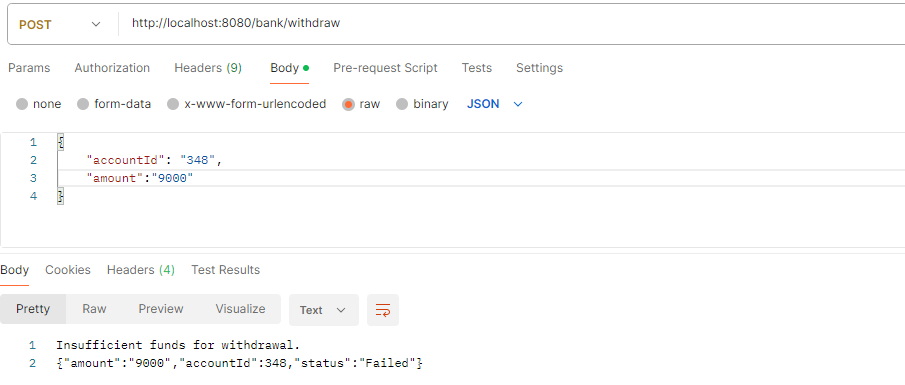
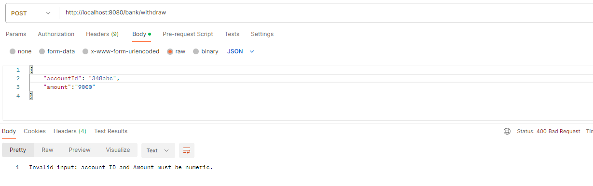

# Bank Withdrawal Event Service

A Spring Boot application that handles basic banking operations, specifically checking account balances and performing withdrawals. The application integrates with AWS SNS to send SMS notifications for successful transactions.

---
> 📝 **Note**: I chose to complete this in **Spring Boot** because the sample code provided looked structurally similar to C# .NET (which I'm more familiar with), so I thought it’d be a good opportunity to try it out!

## Features

-  Check account balance by account ID
-  Perform a withdrawal transaction
-  SMS notification on successful withdrawal (AWS SNS)
-  Input validation and custom exception handling
-  MySQL database integration

---

## Technologies Used

- Java 17+, Spring Boot, Spring Web
- AWS SDK v2 (SNS)
- MySQL
- SLF4J (Logging)

---

## API Endpoints
### `POST /bank/withdraw`

Withdraws a specified amount from an account and sends an SMS upon success.

**Request Body**:
**Example**:
```http
{
  "accountId": "1001",
  "amount": 150.00
}
```

### `GET /bank/balance`

Check the balance of a given account.

**Query Parameters**:
- `accountId` (String): Account ID (numeric string)

**Example**:
```http
GET /bank/balance?accountId=1001
```

## Error Handling

Handled globally using `@ControllerAdvice`:

| Exception                          | Message                                               | HTTP Status |
|-----------------------------------|-------------------------------------------------------|-------------|
| `NumberFormatException`           | Invalid input: account ID and Amount must be numeric | 400         |
| `AccountNotFoundException`        | Account ID not found                                 | 404         |
| `InsufficientFundsException`      | Insufficient funds for withdrawal                    | 400         |
| `InvalidRequestException`         | Invalid account ID or amount                         | 400         |
| `HttpMessageNotReadableException` | Invalid input: account ID and Amount must be numeric.| 400         |
| `ProcessingRequestFailed`         | Generic processing failure                           | 400         |
| `Exception`                       | Internal server error                                | 500         |

## Screenshots
**Success Withdrawal**
```
Request from Postman:
```

```
Response:
```

```
SMSText:
```

``` 
Insufficient Funds:
```

```
Invalid Account:
```



